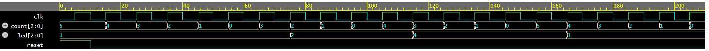

# FPGA Traffic Light Controller (FSM)

### Project Overview
This project implements a Finite State Machine (FSM) in Verilog to control a standard traffic light sequence. It demonstrates sequential logic design, timing control, and state transition management for digital systems.

### Core Technologies
* **Hardware Target:** Altera DE0 Development Board (Cyclone III FPGA)
* **Language:** Verilog HDL
* **Tools:** Intel Quartus 2 13.0 Web Edition
* **Concepts:** Finite State Machine (FSM), Sequential Logic, Clock Dividers, Testbench Verification

### Simulation Results
The state transitions (e.g., Green -> Yellow -> Red) and timing intervals were fully verified using a custom testbench and waveform simulation.

As shown in the waveform above, the FSM accurately transitions through the defined states based on the clock signal, ensuring a reliable traffic control sequence.
